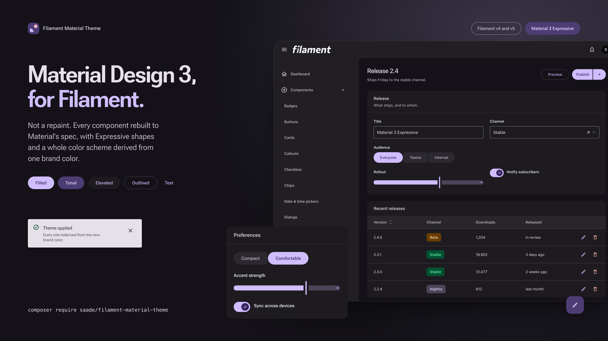
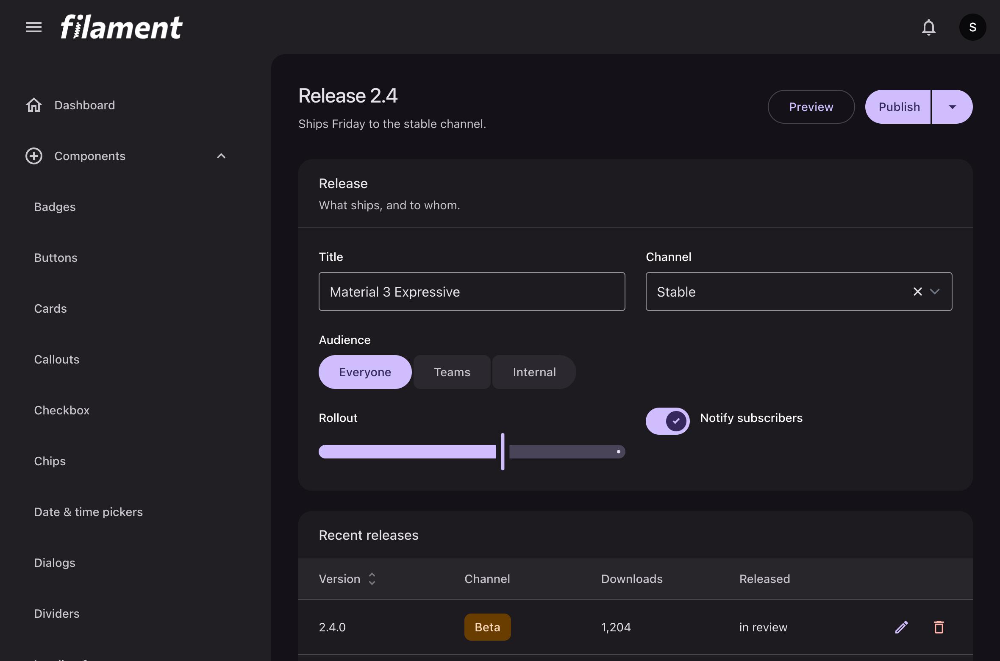
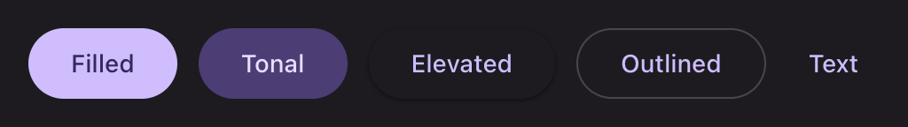
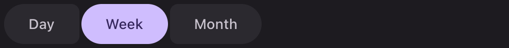
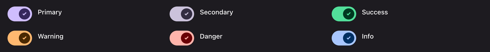
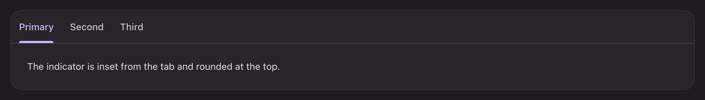
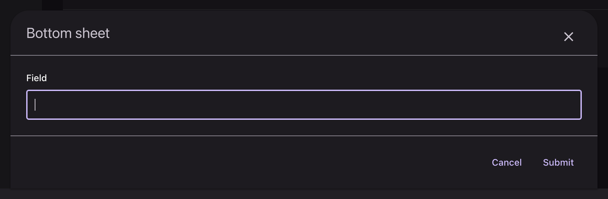
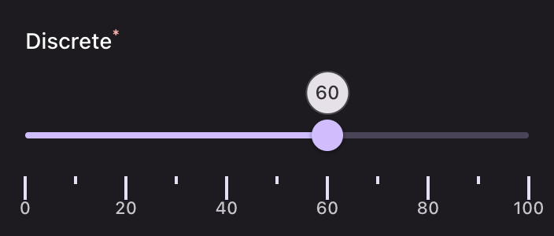

<p align="center">
    <a href="https://filament-material-theme.saade.dev">
        
    </a>
</p>

<h1 align="center">Filament Material Theme</h1>

<p align="center">
    Material Design 3 for Filament. Not a repaint: every component rebuilt to Material's spec,
    with Expressive shapes and a whole color scheme derived from one brand color.
</p>

<p align="center">
    <a href="https://filament.saade.dev/material"><b>Live demo</b></a>
    &nbsp;·&nbsp;
    <a href="https://filament-material-theme.saade.dev"><b>Documentation</b></a>
</p>

---

## What you get

Import the stylesheet and every Filament component takes its Material form. No markup to change, no
components to swap, no classes to carry around.

```php
use Saade\FilamentMaterialTheme\FilamentMaterialThemePlugin;

$panel->plugin(
    FilamentMaterialThemePlugin::make()->source('#6750A4'),
);
```

That one color is the whole of theming in the usual case. Material derives the primary from it,
along with the secondary, the tertiary, every surface tone and every outline, in both modes.

### Variants you ask for by name

Material ships most components in more than one form. Each is reached through a method on the
Filament component that renders it:

```php
Action::make('save')->tonal();                 // filled tonal button
Action::make('compose')->icon($icon)->fab();   // floating action button
ActionGroup::make([...])->splitButton();       // split button
Action::make('edit')->bottomSheet();           // bottom sheet instead of a modal

TextInput::make('name')->filledField();        // filled text field
Section::make('Details')->outlined();          // outlined card
TextColumn::make('status')->badge()->outlinedBadge();
Tabs::make('details')->secondary();
```

### A tour

<p align="center">
    
</p>

<table>
<tr>
<td width="50%"></td>
<td width="50%"></td>
</tr>
<tr>
<td>Every button variant, in five sizes and every Filament color</td>
<td>The connected button group, as Material 3 Expressive redrew it</td>
</tr>
<tr>
<td></td>
<td></td>
</tr>
<tr>
<td>Switches on Material's geometry, driven by <code>onColor()</code></td>
<td>Primary and secondary tabs</td>
</tr>
<tr>
<td></td>
<td></td>
</tr>
<tr>
<td>Dialogs, side sheets and bottom sheets</td>
<td>The slider on its Expressive anatomy</td>
</tr>
</table>

More of everything, component by component, in the
[documentation](https://filament-material-theme.saade.dev).

## Highlights

- **Every component, not the common ones.** Actions, schemas, forms, tables, infolists, widgets,
  notifications and the panel's own navigation are all rebuilt. The
  [component index](https://filament-material-theme.saade.dev/reference/components) lists what each
  one maps to in Material.
- **Material 3 Expressive** where Material has moved on: button groups, split buttons, FAB menus,
  the new slider anatomy and toolbars.
- **Dynamic color.** The scheme is derived in the browser from one source color, so it can change at
  runtime without a rebuild, per user if you want it to.
- **Both modes from the same seed.** Nothing to configure for dark mode.
- **Material icons**, optional, answering Filament's icon aliases from Google's set.
- **A component the theme adds**: a Material divider, since Filament has none.

## Requirements

|                      |                                                |
| -------------------- | ---------------------------------------------- |
| PHP                  | 8.2 or later                                   |
| Filament             | v4 or v5                                       |
| A custom panel theme | Required, since the package ships a stylesheet |
| A license            | One per project, with a year of updates        |

## Installation

The package is distributed from a private Composer repository and needs a license. The
[installation guide](https://filament-material-theme.saade.dev/getting-started/installation) has the
whole of it: the repository, the credentials, the stylesheet import and the plugin registration.

## This repository

The documentation site, built with VitePress and published to
[filament-material-theme.saade.dev](https://filament-material-theme.saade.dev). The package itself
lives apart from it.

```bash
npm install
npm run dev          # http://localhost:5173
npm run build        # docs/.vitepress/dist
npm run screenshots  # recapture every image from a running panel
```

Every image on the component pages is captured from a real panel rather than drawn by hand, so the
documentation cannot drift from what the theme renders. See
[`docs-assets/README.md`](docs-assets/README.md) for how the capture, the demo links and the favicons
are built.

## License

The documentation in this repository is open. The theme itself is a commercial package; see the
[documentation](https://filament-material-theme.saade.dev) for how to get it.
